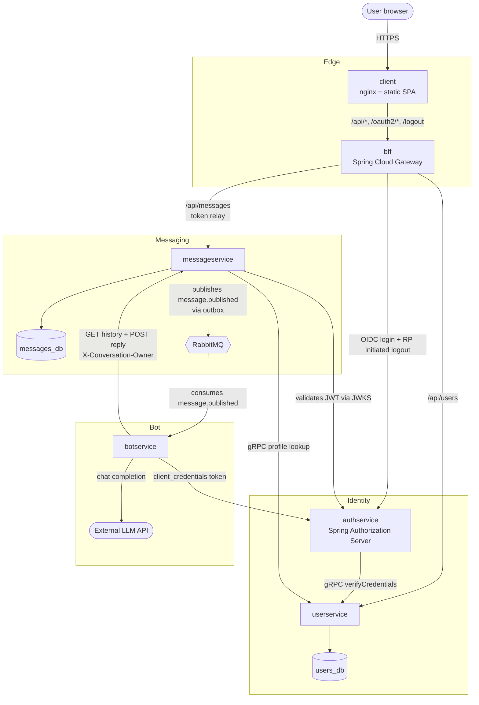

# Triasent

A microservices chat application where users converse with an LLM-backed assistant. Built
to explore real-world OAuth2 (Spring Authorization Server), a BFF gateway, an event-driven
bot reply path, and per-user conversation isolation — running either with Docker Compose
or on Kubernetes.


## Design goals

This project focuses on realistic distributed-system concerns:

- **Secure OAuth2 / OIDC flows** — authorization-code with PKCE for users, client-credentials for service-to-service, RP-initiated logout for a clean SSO end.
- **Stateless edge architecture** — the BFF holds the session cookie; backend services authenticate every request from the JWT.
- **Asynchronous, event-driven processing** — message creation publishes to RabbitMQ; the bot reacts independently of the user's HTTP request.
- **Transactional messaging** — outbox pattern guarantees a `message.published` event is emitted iff the message row is committed.
- **Service-ownership boundaries** — database-per-service, one bounded context per service, no shared schemas.
- **User-isolated conversation history** — per-user `owner_user_id` (UUID) partitioning means each user only sees their own thread, even though the bot writes back as a single shared identity.
- **Production-style deployment patterns** — same architecture in Docker Compose and Kubernetes; secrets injected from environment, never committed.

## Architecture



## Services

| Service          | Port  | What it does                                                                                 |
|------------------|-------|----------------------------------------------------------------------------------------------|
| `client`         | 8090  | nginx serving a single-page chat UI; proxies API/auth paths to the BFF.                      |
| `bff`            | 8080  | OAuth2 client + reverse proxy. Holds the user session cookie, relays JWTs to backends.       |
| `authservice`    | 9000  | OIDC authorization server. Issues JWTs for users (authorization code) and the bot (client credentials). |
| `userservice`    | 8083  | Account CRUD + credential verification. Owns `users_db`. Talks gRPC to authservice.          |
| `messageservice` | 8081  | Persists messages, publishes `message.published` events via a transactional outbox. Owns `messages_db`. |
| `botservice`     | —     | Consumes `message.published`, pulls the user's transcript from messageservice, calls the LLM, posts the reply. |

Stateful infra: two PostgreSQL instances (database-per-service) and a RabbitMQ broker
(events). In Compose these are containers; in Kubernetes they come from the Bitnami Helm
charts (see [`k8s/README.md`](k8s/README.md)).

## Identity model

Every JWT subject (`sub`) is a **stable user UUID**, not a username:

- **Users** — authservice's `UserServiceAuthenticationProvider` sets the principal to the
  UUID returned by userservice's `verifyCredentials` gRPC, so the issued JWT's `sub` is
  that UUID. The display name is fetched on demand via `getUserProfile`.
- **The bot** — uses `client_credentials`, whose default `sub` would be the client id
  (`"bot"`). authservice's `OAuth2TokenCustomizer<JwtEncodingContext>` overrides the
  subject to a reserved synthetic UUID (`00000000-0000-0000-0000-000000000b07`, configured
  via `app.bot.user-id` — the same value lives in messageservice and botservice for the
  authorization check and loop prevention respectively).

messageservice stores authorship and thread ownership as UUIDs (`user_id` /
`owner_user_id`) — never usernames. This means a user can rename themselves in
userservice without orphaning their own messages, and the per-user filter (see below)
keys off something stable.

## How a turn works

1. User posts a message → SPA → BFF (`/api/messages` POST) → messageservice saves it
   with `user_id = owner_user_id = <user-uuid from JWT>` and writes an outbox row in the
   same transaction.
2. The outbox relay publishes a `message.published` event to RabbitMQ (payload carries
   `userId`, not username).
3. botservice consumes the event, fetches the full transcript for that user via
   `GET /messages?ownerUserId=<user-uuid>` (its JWT subject is the reserved bot UUID,
   the only subject messageservice lets read another owner's thread), calls the LLM,
   and POSTs the reply back to messageservice with `X-Conversation-Owner: <user-uuid>`
   and an `Idempotency-Key`.
4. The SPA polls `GET /api/messages`, which filters by the caller's JWT subject — so
   each user only ever sees their own conversation. The response enriches each row with
   the author's current display name via gRPC to userservice (bot rows show up as `"bot"`
   without an RPC roundtrip).

Conversation history lives in `messages_db` only — there's no separate bot cache, so
context survives bot restarts and is consistent across replicas.

## Run locally (Docker Compose)

Prerequisites: Docker, Java 25, Maven (the wrapper `./mvnw` is fine), `openssl` for secret
generation.

1. **Build the five app images** (no aggregator pom — each module is its own build):
   ```sh
   for m in userservice authservice messageservice bff botservice; do
     (cd "$m" && ./mvnw spring-boot:build-image -DskipTests)
   done
   ```

2. **Create `.env`** at the repo root with the values Compose needs:
   ```sh
   cp .env.example .env
   # then edit .env, or replace with generated values:
   cat > .env <<EOF
   DB_PASSWORD=$(openssl rand -hex 16)
   RABBITMQ_PASSWORD=$(openssl rand -hex 16)
   GATEWAY_CLIENT_SECRET=$(openssl rand -hex 24)
   BOT_CLIENT_SECRET=$(openssl rand -hex 24)
   EOF
   ```

3. **Create `botservice/.env`** with the LLM credentials:
   ```sh
   cat > botservice/.env <<EOF
   LLM_API_URL=https://api.openai.com/v1/chat/completions
   LLM_API_KEY=sk-...
   LLM_API_MODEL=gpt-4o-mini
   EOF
   ```

4. **Add a hosts entry** so the browser can reach the OIDC issuer at the same name the
   containers use:
   ```sh
   echo "127.0.0.1 authservice" | sudo tee -a /etc/hosts
   ```

5. **Bring it up:**
   ```sh
   docker compose up -d
   ```

6. Open <http://localhost:8090>. RabbitMQ UI: <http://localhost:15672> (user `app`,
   password from `.env`).

**Tear down** (keep volumes): `docker compose down`. **Wipe data:** `docker compose down -v`.

## Run on Kubernetes

See [`k8s/README.md`](k8s/README.md). Same architecture, with Bitnami Helm charts for
Postgres/RabbitMQ and Kubernetes Secrets in place of `.env` files.

## Repository layout

```
authservice/      OIDC authorization server
bff/              gateway + OAuth2 client (SPA-facing)
botservice/       LLM worker (RabbitMQ consumer)
client/           nginx + static SPA (index.html, nginx.conf)
messageservice/   message API + outbox + event publisher
userservice/      account + credential service
docker-compose.yml
k8s/              Kubernetes manifests + README
.env.example      template for the Compose secrets
```

